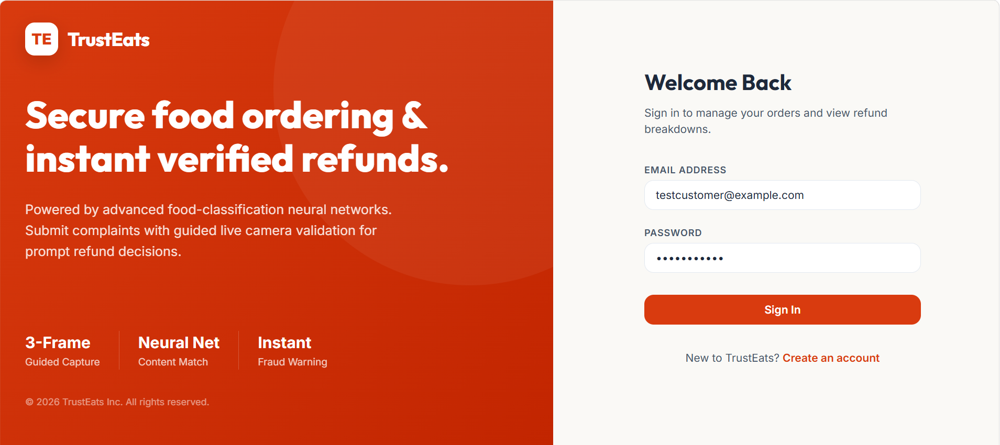
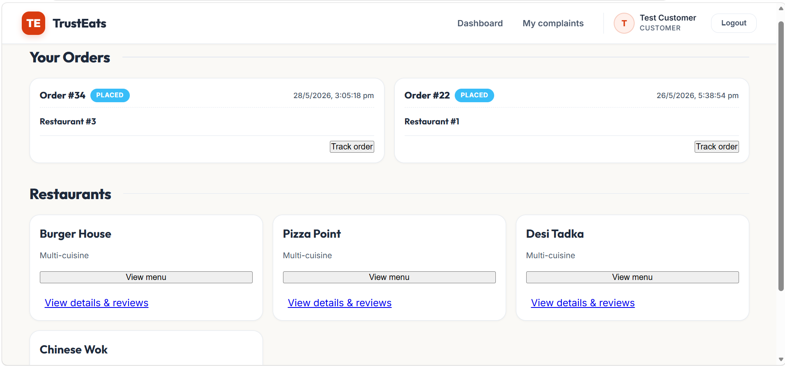
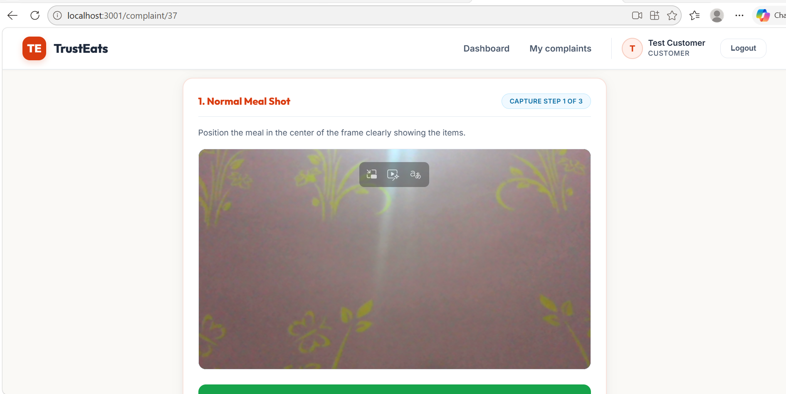
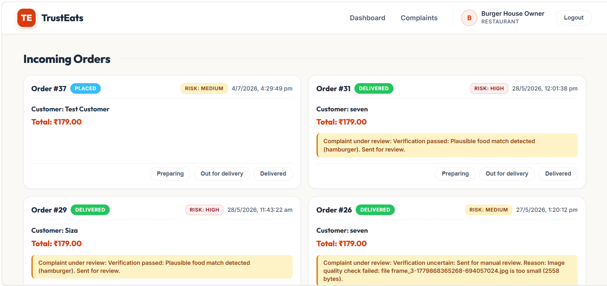
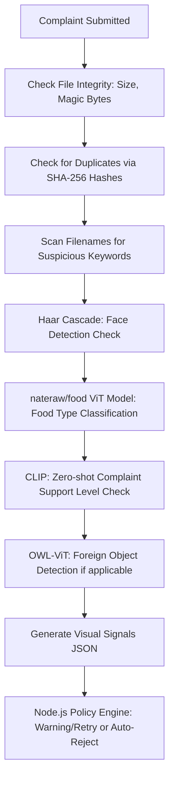

# 🍔 TrustEats: Automated AI-Assisted Complaint Verification & Fraud Prevention

TrustEats is a full-stack food ordering and automated complaint triage platform designed to address a critical business problem in the food-delivery industry: **fraudulent refund requests**. 

The application utilizes a guided multi-frame mobile camera evidence workflow, a backend business policy engine, and computer vision models (OpenCV, Hugging Face ViT, CLIP, OWL-ViT) to determine whether refund claims (such as wrong items, foreign objects, or missing items) are authentic or fraudulent.

---

## 📸 UI & Dashboard Walkthrough

Below are the key interfaces and system visualizations of TrustEats:

### 1. Unified Dashboard
A central hub for customers to view restaurants, place orders, track live statuses, and file complaints, and for restaurants to manage incoming orders and view flagged disputes.


### 2. Guided Camera Evidence Capture & Complaint Flow
Customers are guided through a strict 3-frame capture process (normal meal shot, changed angle, packaging/receipt/context) to submit evidence, ensuring structured inputs for the verification engine.


### 3. AI Verification Pipeline
The backend spawns a Python visual verifier executing face detection, food classification matching, and zero-shot anomaly support verification.


### 4. Review Quality & Trust Analysis
Review texts are analyzed via an NLP model to classify them as suspicious or authentic, helping keep the platform's ratings system free from spam.


---

## ⚖️ The Problem & The Solution

### **The Problem**
Legitimate food delivery platforms lose significant revenue to refund abuse. Common fraudulent claims include:
- **Wrong Item Claims:** Uploading a photo of a different meal or stock image.
- **Foreign Objects:** Fabricating contaminants (e.g., claiming bugs/hair are present by reusing images or photoshopped evidence).
- **Missing Items:** Claiming items were missing when they were delivered.
- **Evidence Replay/Screen Recaps:** Re-uploading screenshots of previous orders or stock images found online.

### **The Solution**
TrustEats enforces a robust, multi-stage validation pipeline:
1. **Guided 3-Frame Capture:** The client-side camera forces three different perspectives of the food and packaging.
2. **File & Integrity Verification:** Eliminates file reuse via cryptographic hashing and image metadata inspection.
3. **Computer Vision Validation:** Automatically determines if the food in the photo matches what was ordered, blocks photos with faces, and evaluates complaint claims.
4. **Policy & Retry Engine:** Automatically handles stateful policies, offering warnings and retries on first mismatch, and auto-rejecting repeat offenses.

---

## 🛠️ Technology Stack

| Component | Technology | Description |
| :--- | :--- | :--- |
| **Frontend** | React 19, React Router 7, Axios, Socket.io-client, Framer Motion | Dynamic user/restaurant panels, live order status updates, and interactive camera flow. |
| **Backend** | Node.js, Express 5, MySQL (`mysql2`), Multer, JWT | REST API, role-based JWT auth (`CUSTOMER`, `RESTAURANT`, `ADMIN`), and file upload handling. |
| **Real-time** | Socket.io | Bidirectional event communication for order placement and status transitions. |
| **Task Runner** | Node-cron | Auto-archival of delivered orders after 30 minutes if no complaints are filed. |
| **Machine Learning** | Python, OpenCV, PyTorch, Hugging Face Transformers, Scikit-learn | Multi-modal visual verifier and NLP text classifier. |

---

## ⚙️ How the AI Verification Engine Works

When a customer submits a complaint, the Node.js backend calls a Python visual verifier (`verify_image.py`) which processes the three images against the following pipeline:



* **Face Filtering (OpenCV):** Rejects any evidence containing faces to protect privacy and filter out invalid context.
* **Food Classification (`nateraw/food`):** Matches the labels in the images against the expected menu items from the SQL database.
* **Semantic Support (CLIP):** Analyzes whether the images visually align with the reported complaint type.
* **Contaminant Search (OWL-ViT):** Searches for target objects (e.g. insects, hair, plastic) in the case of `FOREIGN_OBJECT` complaints.

---

## 🚀 Installation & Local Setup

### Prerequisites
- Node.js (v18+)
- MySQL
- Python 3.10+ (with `pip`)

### 1. Database Setup
Create a MySQL database named `trusteats_db` and configure your credentials.

### 2. Backend Setup
1. Navigate to the `backend/` directory:
   ```bash
   cd backend
   ```
2. Create a `.env` file based on the environment configurations:
   ```env
   PORT=5000
   DB_HOST=localhost
   DB_USER=root
   DB_PASSWORD=your_mysql_password
   DB_NAME=trusteats_db
   JWT_SECRET=your_jwt_secret
   ```
3. Run the database seed scripts to initialize menu items and user accounts:
   ```bash
   node test-db.js
   ```
4. Start the backend server:
   ```bash
   node src/server.js
   ```

### 3. Frontend Setup
1. Navigate to the `frontend/` directory:
   ```bash
   cd ../frontend
   ```
2. Create a `.env` file:
   ```env
   PORT=3001
   ```
3. Start the React development server:
   ```bash
   npm start
   ```
   *The client will run at `http://localhost:3001`.*

---

## 🔒 Security & Scaling Considerations
- **Admin Accounts:** Public admin self-registration should be secured in production by requiring invitations.
- **Inference Service:** In production, the Python ML pipeline should run as a long-lived FastAPI/gRPC microservice to avoid process spawn latency.
- **Static Content:** Uploaded images are served via `/uploads` and should be moved to a private bucket (e.g., AWS S3) with authenticated, short-lived URLs.
